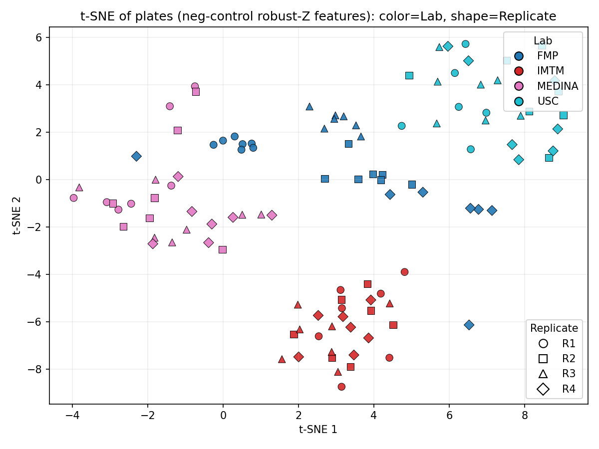
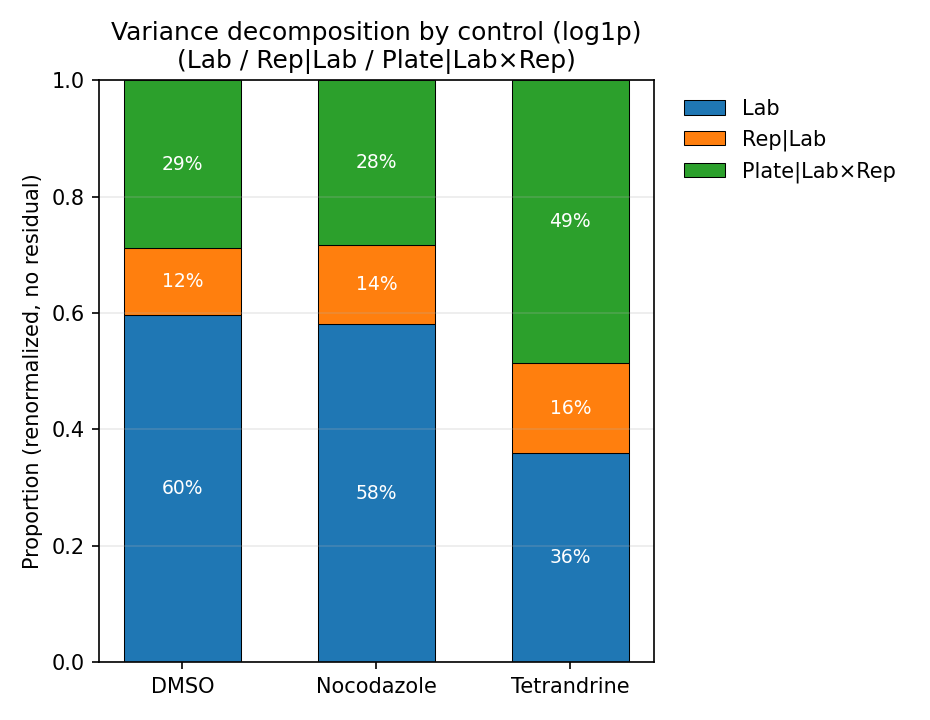

```{r setup, include=FALSE}
knitr::opts_chunk$set(echo = TRUE)
```

The following shows a t-SNE of the plates after robust z-scoring, colored by the negative control wells. It shows that even after normalization, we do not have equality in the experiments, which significantly bear some lab effects and replicate effects.




## Variance decomposition of controls across labs, replicates, and plates

To assess sources of variability in our assay, we performed a **nested variance decomposition** on three control compounds: **DMSO** (negative control), **Nocodazole**, and **Tetrandrine** (positive controls). We decompose the per–well cell counts $y$ into nested sources of variation. In particular, we decompose the variance as:$$
\begin{aligned}
\sigma^2_{\text{Lab}} &= \mathrm{Var}(y) - \mathrm{Var}(r_1),\\[6pt]
\sigma^2_{\text{Rep}\mid\text{Lab}} &= \mathrm{Var}(r_1) - \mathrm{Var}(r_2),\\[6pt]
\sigma^2_{\text{Plate}\mid\text{Lab}\times\text{Rep}} &= \mathrm{Var}(r_2) - \mathrm{Var}(r_3),\\[6pt]
\sigma^2_{\text{res}} &= \mathrm{Var}(r_3).
\end{aligned}
$$

Where let $r_i$ denote the residuals after subtracting the corresponding conditional mean. For interpretability, we discard the residual component, which captures well-specific noise not explained by systematic factors, and renormalize the systematic parts so that their proportions sum to one. We perform this decomposition for each control compound separately.



-   **DMSO (negative control)**\
    The majority of variance is attributable to **lab-level effects** (\~60%), with smaller contributions from replicate (\~12%) and plate (\~29%). This indicates that even the baseline control is sensitive to systematic differences between labs.

-   **Nocodazole (positive control for mitotic arrest)**\
    Shows a very similar pattern: lab effects dominate (\~58%), with replicate and plate effects accounting for \~14% and \~28%, respectively. This suggests that the Nocodazole behaviour is also influenced primarily by inter-lab variability.

-   **Tetrandrine (positive control for cell death)**\
    Displays a different profile: lab variance is lower (\~36%), while **plate effects** contribute nearly half of the systematic variance (\~49%). This implies that the Tetrandrine response is less consistent across plates, making it more sensitive to plate-specific variation.

This decomposition reveals that: (1) **Lab effects dominate** for DMSO and Nocodazole, highlighting cross-lab biases; (2) **Plate-specific variability** is especially important for Tetrandrine, pointing to a potential compound-specific sensitivity to assay conditions.

In practice, these results emphasize the need for **control-based normalization** (e.g., robust Z anchored to DMSO).

## Compound-level distributions after negative-control standardization

To visualize a first assessment of effectiveness, we first **standardize cell counts within each plate using only negative controls (DMSO/EOS)**.  
For plate \(p\), each observation \(y_{p,i}\) is transformed as

\[
z_{p,i} \;=\; 
\frac{y_{p,i} - \mathrm{median}\{\text{neg ctrls on }p\}}
     {1.4826 \cdot \mathrm{MAD}\{\text{neg ctrls on }p\}} ,
\]

so that per-plate medians of negative controls are set to zero and scaled by their median absolute deviation.  
This removes plate-level shifts and scaling while preserving biological differences across compounds.  
The x-axis is flipped (high→low), so moving **right** corresponds to **lower cell counts than the negative control** (i.e. stronger inhibitory effect).

- **Bottom panel:** each compound is shown as a horizontal box-line.  
  * Thin line = p05–p95  
  * Thick line = IQR (p25–p75)  
  * Black dot = median of \(z\)  
  Compounds are ordered by their **median** standardized count.  

- **Top panel:** kernel density of per-compound medians, with vertical dotted lines marking the medians of **DMSO** (≈0 by construction), **Tetrandrine**, and **Nocodazole**.


Most compounds cluster around zero wit a large peak near DMSO, indicating little or no shift from the negative control after plate normalization.  
The distribution has a long rightward tail, meaning many compounds substantially reduce cell counts compared to DMSO.  

Control landmarks fall where expected: Tetrandrine lies left of Nocodazole, consistent with a weaker effect; Nocodazole is further right, reflecting a stronger effect.

Within-compound spread (IQR and p05–p95) highlights residual heterogeneity. Narrow bars near zero indicate stable, control-like behavior, while wide bars in the tail suggest stronger or context-dependent effects worth follow-up. In general, we can see different compounds display very different distributions across experiments.


