```{r setup, include=FALSE}
knitr::opts_chunk$set(echo = TRUE)
```
## Introduction

**Purpose of this report.** This report presents an exploratory analysis of a multi-site, multi-replicate high-content imaging screen of a liver cancer cell line (HepG2). The goal is to visualize raw data, identify and characterize technical biases (site, plate, replicate effects), apply control-anchored normalization, assess reproducibility across labs and replicates, and evaluate compound effectiveness. We use heatmaps, boxplots, t-SNE embeddings, variance decomposition, and clustering to dissect the data structure and guide downstream analyses.


**Dataset.** The dataset contains a multi‑site, multi‑replicate high‑content imaging screen of a liver cancer cell line (**HepG2**). The experiments test **2,464 compounds** from EU‑OPENSCREEN on **384‑well plates** with **7 plates** per run. Each plate includes shared controls: **DMSO** (vehicle/negative) and the positive controls **Nocodazole** and **Tetrandrine**. Every plate is replicated **4 times**, and the entire process is repeated at **4 labs** (FMP, IMTM, MEDINA, USC), yielding **112 plates** and **43,008 wells** overall. Cells are stained with a panel of **six fluorescent dyes** that label major cellular compartments (e.g., nucleus, cytoplasm, ER, Golgi, mitochondria, actin), imaged at high resolution, and quantitative readouts are extracted per well.

The report is organized as follows. **Section 1** explores the raw data, highlighting site-, plate-, and replicate-level biases through heatmaps and distributional summaries. **Section 2** introduces control-anchored normalization and evaluates its ability to reduce technical artifacts while preserving biological structure. **Section 3** quantifies reproducibility across laboratories and replicates, using t-SNE embeddings and variance decomposition, and provides a first overview of compound-level distributions. **Section 4** applies clustering analyses to group compounds by behavior relative to controls, offering insight into potential mechanisms of action.

## Section 1: Raw data exploration and technical bias assessment
In this section, we examine the raw data prior to any correction. By inspecting spatial heatmaps, we try to separate biological signals from technical artifacts and gain an initial sense of the characteristic patterns these artifacts produce. This early exploration provides the foundation for the normalization steps that follow.

In the raw heat maps, color directly reflects magnitude on a perceptually uniform scale: lighter or brighter tiles correspond to higher values (for example, more cells or larger nuclei) and darker tiles indicate lower values. When plates are concatenated side by side, transitions every 24 columns mark plate boundaries; abrupt level shifts at these boundaries indicate plate effects. Vertical streaks suggest column or dispensing issues, horizontal bands point to row-related illumination or evaporation artifacts, and bright or dark frames around the border reveal edge effects. Checkerboard-like alternation can indicate patterned dispensing or processing differences. Taken together, these patterns separate technical structure from true biological signal and motivate the normalizations applied in the next section of the report.

To illustrate these principles, we first present raw cell-count heatmaps across replicates and sites. We then summarize counts by site and plate to make systematic offsets clearer, followed by replicate-specific views that expose run-to-run shifts within the same lab. Next, we complement cell counts with additional readouts such as nucleus area and nucleus-intensity channels, which provide a useful contrast: some features remain relatively stable while others are strongly affected by technical factors. Finally, we compare cell-count distributions using boxplots, which quantify baseline differences across sites and motivate the adoption of control-anchored normalization. Together, these visualizations build an argument for how technical artifacts manifest in the raw data and why careful normalization is essential.

#### Raw cell-count heatmaps (replicate × site)

```{r fig_counts, fig.cap="Raw cell-count heatmaps (replicate × site). Spatial structure is visible at multiple scales.", out.width='50%', fig.pos='H'}
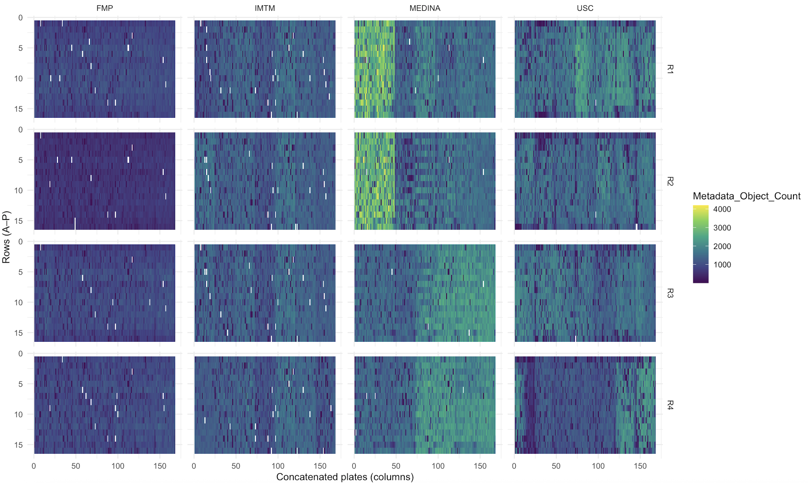
```

**Observations and patterns.** The raw count maps show clear spatial structure within and across plates. Within plates, vertical and horizontal banding point to column and row effects, while pronounced borders might indicate edge-related evaporation or illumination falloff. Across concatenated plates, step changes at the joins reveal plate-specific baselines. Large differences are evident across sites and even across replicates within the same site. In particular, the MEDINA panels display a striking inversion: in replicate 1, the first two plates are warm/yellow (higher counts) while the later plates are cool/blue (lower counts); in replicate 3 the pattern reverses—early plates are low and later plates high. This flip within a single site across runs cannot be explained by biology and points to replication-specific shifts. Together with cross-site level offsets and the plate-wise steps, the conclusion is that **strong site-, replicate-, and plate-level technical biases dominate the raw signal**.

#### Plate and site biases (counts by site × plate summary)

```{r fig_siteplate, fig.cap="Counts summarized by site and plate. Baseline shifts are systematic rather than random noise.", out.width='50%', fig.pos='H'}
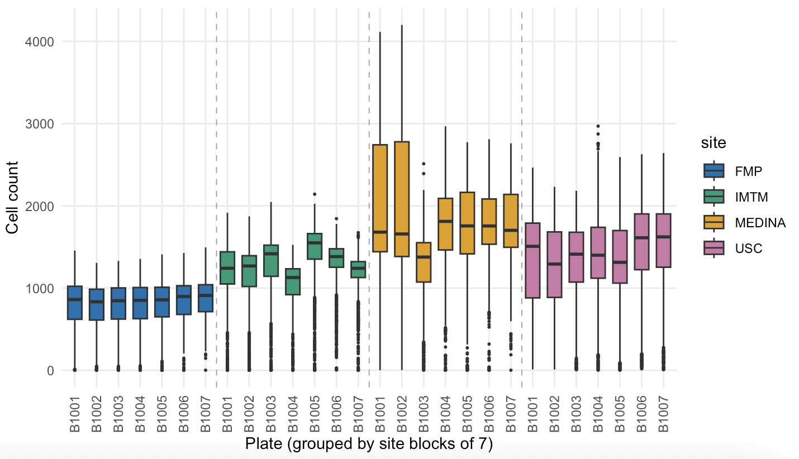
```

**Observations and patterns.** The site–plate summary makes the contrasts explicit. **FMP** shows **little to no difference** across its seven plates—the boxplots align closely in level and spread—indicating minimal within-site plate effect for this lab. By contrast, **MEDINA** exhibits pronounced between-plate shifts (several plates sit markedly higher than others), and **IMTM** shows clear plate-to-plate differences as well (a visible gradient where some mid-block plates are higher than early or late ones). These behaviors are signatures of **plate bias within sites** and, when comparing across the four colors (sites), **site-level baseline offsets**. Without plate-wise, site-wise normalization, such baselines will distort any cross-site or cross-plate comparison.


#### Replication bias (site example across replicates)

```{r fig_rep, fig.cap="Example of replicate-to-replicate variability within a site.", out.width='50%', fig.pos='H'}
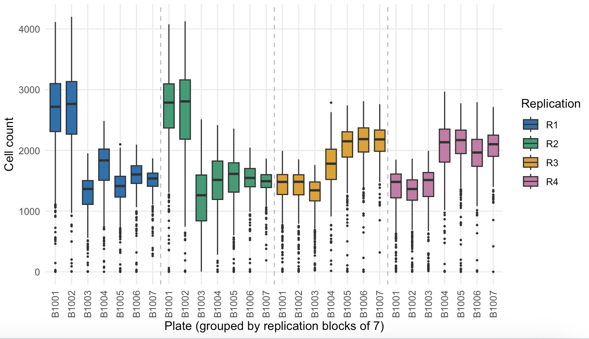
```

**Observations and patterns.**In the earlier overall heatmap, the **first two plates** appeared higher than later plates at this site; however, when we **split by replicate** that pattern **does not hold for all runs**. For example, in **R1** the early plates are high while later plates are low, whereas in **R3** the relationship **reverses**. This inconsistency across runs is a hallmark of **replication bias**—run-specific shifts in level and dispersion—often driven by day-to-day instrument settings, reagent batches, or environmental conditions. Therefore, averaging replicates without **within-replicate** normalization would confound technical drift with biology and should be avoided.


#### Raw nucleus-area heatmaps (replicate × site)

```{r fig_nuc, fig.cap="Raw nucleus-area heatmaps (replicate × site). Complementary view to counts.", out.width='50%', fig.pos='H'}
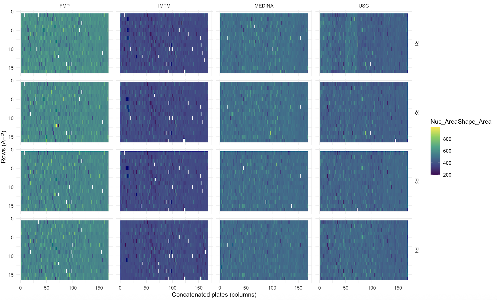
```

**Observations and patterns.** The nucleus‑area maps are comparatively stable across sites and replicates. Most plates fall in a similar value range with modest variation, and we do **not** see the strong inversions that were evident in the raw cell‑count maps. A few localized regions show slightly higher (warmer) or lower (cooler) nucleus‑area values, but these pockets are limited in extent. MEDINA, for example, shows far smaller between‑plate swings in nucleus area than it does in counts; IMTM exhibits mild plate‑to‑plate differences; FMP and USC are largely flat. Overall, the nucleus‑area readout varies **less** across sites/replicates than cell counts, with only isolated high/low patches rather than large cross‑site shifts.

#### Additional features: nucleus intensity channels (AGP, DNA, Mito, ER)

```{r fig_intensity, fig.cap="Nucleus median intensity (AGP, DNA, Mito, ER) shown as heatmaps (replicate × site) with a shared color scale across channels.", out.width='90%', fig.pos='H'}
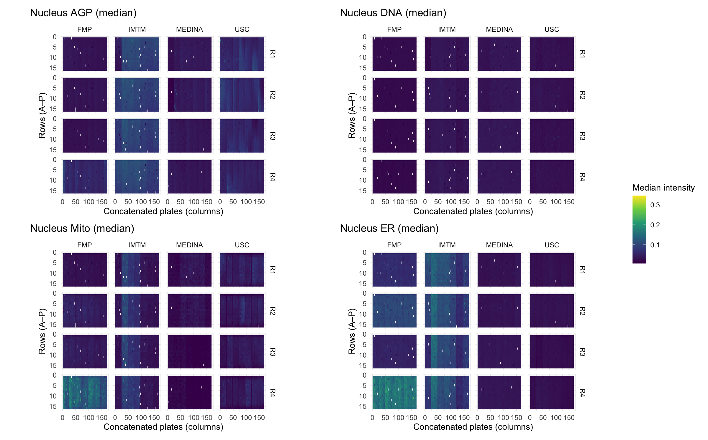
```

**Observations and patterns.** Across channels, the overall dynamic range is modest and most panels occupy a similar value band, indicating broadly comparable staining across sites. The **ER** channel stands out: **IMTM** shows noticeably **higher intensities** than the other sites in multiple replicates and a wider spread across plates, while **FMP** and **USC** remain uniformly **lower**. **MEDINA** is intermediate and shows some plate-to-plate changes but not the large inversions seen in raw cell counts. For **AGP** and **DNA**, intensities are relatively flat across sites with only small plate steps. **Mito** shows a mild elevation at **IMTM** relative to the other sites. Importantly, within **FMP**, **replicate 4** shows **elevated ER and Mito intensities** compared with FMP’s other replicates, suggesting a replicate-specific shift for these channels. In short, the intensity readouts exhibit **site offsets** (especially ER at IMTM) and **plate-level steps** in a few cases, with **replicate‑level elevation at FMP R4 for ER/Mito**; deviations are **largest for ER at IMTM**, moderate for Mito, and **smallest for AGP/DNA**. These patterns reinforce the presence of **site**, **plate**, and **replicate** effects in auxiliary features as well, and support channel-wise robust normalization if these readouts are used downstream.


#### Cell-count distributions (boxplots)

```{r fig_box, fig.cap="Cell-count distributions (boxplots). Structure is consistent across sites and replicates, but medians/levels shift.", out.width='50%', fig.pos='H'}
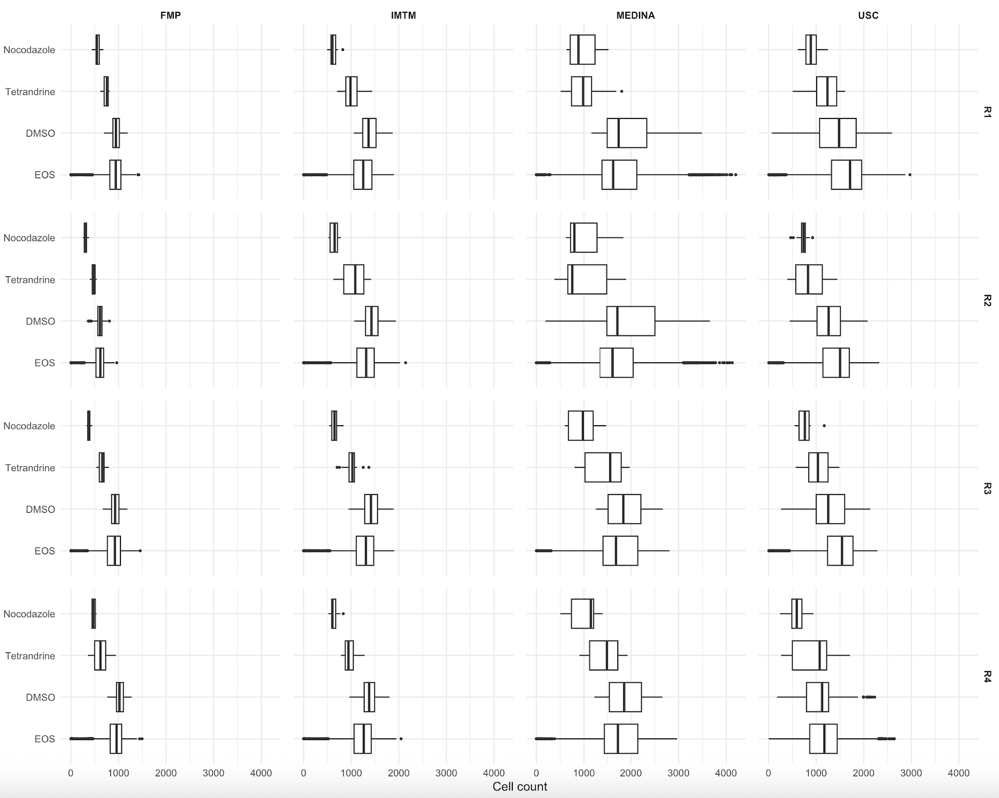
```

**Observations and patterns.** The overall **shape** of the distributions is remarkably similar across sites and across replicates (comparable IQRs and tail behavior), but the **location** (medians) shifts systematically. This is precisely the signature of global baseline differences rather than wholesale distributional changes. Because DMSO is present on every plate and designed to represent the neutral baseline, these boxplots motivate a **control-anchored normalization**: centering each plate × replicate × site on the **DMSO median** and scaling by a robust spread such as **MAD**. This approach directly targets level shifts while preserving the underlying distribution shape and makes comparisons across sites and runs more meaningful.

## Section 2: Normalization
Having established in Section 1 that raw readouts are dominated by replicate- and site-specific biases, we now turn to normalization. The goal is to reduce these technical artifacts' shifts while retaining genuine biological structure. To this end, we apply a **control-anchored normalization**, using DMSO wells as internal baselines on every plate. This strategy provides a consistent reference across experiments and allows us to evaluate whether observed patterns become more comparable across replicates and sites.
In particular, for plate \(p\), each observation \(y_{p,i}\) is transformed as

\[
z_{p,i} \;=\; 
\frac{y_{p,i} - \mathrm{median}\{\text{neg ctrls on }p\}}
     {1.4826 \cdot \mathrm{MAD}\{\text{neg ctrls on }p\}} ,
\]

so that per-plate medians of negative controls are set to zero and scaled by their median absolute deviation.  

In the remainder of this section, we show how control-anchored normalization changes the structure of the data and the previously seen artifacts. We begin with normalized heatmaps of cell counts and nucleus area to evaluate whether replicate-level shifts are removed. We then use correlation analysis across site–replicate pairs to quantify consistency more formally. Next, we present site-averaged heatmaps to highlight stable biological patterns that remain after normalization, followed by variance maps that expose site- and plate-specific differences in reproducibility.

#### Normalization of Cell Count and Nucleus Area

The resulting heatmaps of normalized cell count and normalized nucleus area, shown in the figures heatmap_normalized_cellcount.png and heatmap_normalized_nucleusarea.png, allow us to assess the effect of this adjustment.

```{r fig_norm, fig.cap="Normalized cell-count and nucleus area heatmaps (replicate × site). Site-specific bias is visible.", fig.show='hold', out.width='48%', fig.align='center'}
knitr::include_graphics(c("figures/part2/heatmap_normalized_cellcount.png","figures/part2/heatmap_normalized_nucleusarea.png"))
```

After normalization, replicates within each site now display very similar spatial patterns. The plate-level structures remain, such as gradients along rows or columns and quadrant-specific shifts, but these structures are now reproducible across replicates. This indicates that replicate-level biases, which likely arose from batch-to-batch variability in handling, incubation, or measurement, have been effectively removed by the normalization.

Even after normalization, the heatmaps show clear differences between sites. Each laboratory still has its own spatial fingerprint: one may show a left-to-right gradient, another a top-to-bottom shift, and another localized high or low regions. These patterns are consistent across the four replicates within a site, so they are not random, but they differ systematically from lab to lab. The same is true for nucleus area, where replicates within a site agree but the overall patterns between sites remain distinct. In fact, the differences in nucleus area are sometimes even stronger, suggesting systematic variation in imaging or segmentation. Since the treatments and compound positions are identical across all sites, these site-to-site differences cannot be biological. Instead, they reflect technical factors such as imaging settings, incubation conditions, or handling practices.

The implications of this observation are important. While the normalization clearly succeeded in removing replicate-level biases within each laboratory, it did not eliminate site-level biases. The dominant variation across the dataset is still linked to site-specific technical effects. If compounds are compared or ranked without accounting for these residual differences, the results may reflect laboratory-specific artifacts rather than genuine biological activity. Aggregating results across sites in the absence of further correction could therefore obscure true biological signals and undermine reproducibility.


#### Correlation Analysis of Normalized Cell Counts

After applying plate-wise median and MAD normalization to cell counts and nucleus area, the replicate-level biases within each laboratory were largely removed. However, as seen in the normalized heatmaps, site-specific spatial fingerprints remained, raising the concern that substantial technical variation still separates the data generated in different laboratories. To validate the presence of these site-specific effects in a more quantitative way, we constructed a correlation heatmap across all site–replication combinations. 

For each site and replication, all normalized cell counts were concatenated into a single vector. This produced sixteen vectors in total, one for each of the four sites and four replicates. We then computed the Pearson correlation between every pair of these vectors, resulting in a 16×16 correlation matrix. The heatmap displays these correlations, with darker colors corresponding to lower correlations and lighter colors to stronger positive associations. The matrix is symmetric, with blocks along the diagonal corresponding to the four replicates within each site.


```{r fig_norm_corr, fig.cap="Correlation of normalized cell counts (replicate × site). Site-specific bias is visible.", out.width='50%', fig.pos='H'}
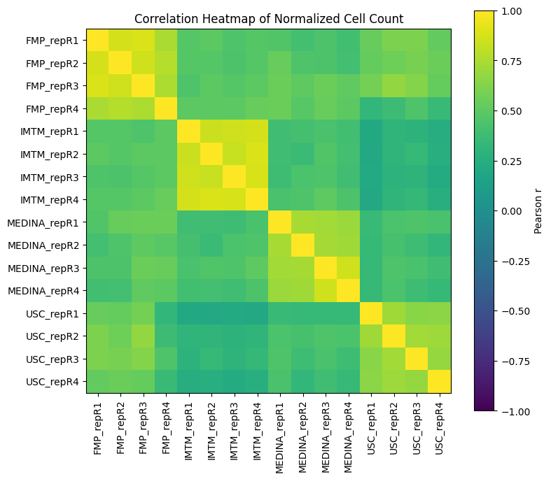
```

The pattern in this heatmap is very informative. Within each site, the correlations between replicates are uniformly high. In the FMP block, for example, all four replicates are highly correlated with one another. The same is true for IMTM, MEDINA, and USC. This confirms what was already suggested by the normalized heatmaps: after normalization, the replicates within a site are strongly aligned, and replicate-to-replicate variation has been effectively removed. The normalization succeeded at the within-lab level.

In contrast, the correlations between different sites are much lower. Comparisons of a replicate from FMP with one from MEDINA, or IMTM with USC, generally yield only moderate correlations, which stand in stark contrast to the near-perfect correlations observed within a site. These reduced correlations are consistent across the entire matrix, meaning the phenomenon is not limited to one problematic site. Instead, each laboratory retains its own reproducible but distinct profile. This divergence cannot be attributed to biology, since the compounds and well assignments are identical across sites. The low cross-site correlations are therefore direct evidence of residual site-specific technical biases.

The interpretation is that the normalization procedure aligned replicates within each laboratory, but did not harmonize across laboratories. The correlation heatmap is particularly valuable because it validates this conclusion in a rigorous and quantitative way. While qualitative inspection of heatmaps could suggest site-specific patterns, the correlation matrix demonstrates unambiguously that replicates from the same lab cluster together while replicates from different labs diverge. The clustering visible in the heatmap makes the argument especially clear: the matrix shows four tight, high-correlation blocks on the diagonal (one per lab), but much weaker associations between blocks.


#### Site-Averaged Normalized Cell Counts

To further investigate site-specific biases after normalization, we averaged the normalized cell counts across the four replicates within each laboratory. This aggregation reduces replicate-to-replicate noise and emphasizes the stable patterns that characterize each site. For each plate, we then visualized the averaged values in the form of heatmaps. The figures below present these results for plates 2 and 3 respectively. Each figure contains four heatmaps, corresponding to the four sites (FMP, IMTM, MEDINA, and USC). Within each panel, the color represents the site-averaged normalized cell count for each well on the plate.

```{r fig_avg, fig.cap="Average normalized cell count (plate 2, 3). Site-specific bias is visible.", fig.show='hold', out.width='48%', fig.align='center'}
knitr::include_graphics(c("figures/part2/avg/heatmap_avg_cellcount_plate2.png","figures/part2/avg/heatmap_avg_cellcount_plate3.png"))
```

When examining these heatmaps, a clear observation emerges. Across the four sites, the spatial patterns within a given plate are remarkably similar. In plate 2, for instance, regions of high and low cell count appear in corresponding positions across all four sites, and the same is true in plate 3. This consistency strongly suggests that the underlying structure of the heatmap reflects the biological signal of compound effects. Since the compounds occupy the same wells in all plates, the repeated emergence of these patterns across laboratories validates that they are not artifacts of handling or imaging, but rather reproducible biological effects driven by the compounds themselves.

At the same time, there are clear differences in color intensity across the sites. One laboratory may show the same spatial pattern as another, but with consistently brighter or darker shading. This indicates that although the spatial structure is preserved, the overall scale of the normalized responses differs between laboratories. Such intensity differences are not expected from biology, because the compounds are identical, and their effects on cell count should be invariant across sites. Instead, these shifts represent site-specific technical biases that were not eliminated by the normalization. Possible sources include differences in imaging equipment, segmentation thresholds, or systematic differences in growth conditions between laboratories.

#### Site-Specific Variance Across Plates

To directly visualize the degree of site-specific bias that remains after normalization, we computed the variance of normalized cell counts across replications within each laboratory. For every plate, the normalized values were averaged within site–replication groups, and then the variance across replicates within the same site was calculated for each well. This produced a variance heatmap for each site and plate. Figures below present the results for plates 1 and 2. In each heatmap, lighter colors indicate higher variance across replicates within a site, while darker colors indicate lower variance, i.e., greater consistency within a site.

```{r fig_var12, fig.cap="Variance normalized cell count (plate 1,2). Site-specific bias is visible.", fig.show='hold', out.width='48%', fig.align='center'}
knitr::include_graphics(c("figures/part2/var/heatmap_var_cellcount_plate1.png","figures/part2/var/heatmap_var_cellcount_plate2.png"))
```

The patterns in plates 1 and 2 illustrate clear differences in site-specific variability. FMP shows very small variance across its replicates, producing relatively dark and uniform heatmaps, which suggests that the experiments conducted at FMP were internally consistent and replicates were well aligned by normalization. By contrast, IMTM exhibits much higher variance, as shown by brighter colors in the corresponding heatmaps. This indicates that replicate-to-replicate consistency within IMTM is weaker, and technical variability across repetitions remains higher at this site. MEDINA and USC lie between these extremes, with intermediate levels of replicate variance. The conclusion from plates 1 and 2 is that site-specific reliability differs markedly: some sites, like FMP, generate highly reproducible replicates, while others, like IMTM, are more prone to replicate-level noise even after normalization.

```{r fig_var67, fig.cap="Variance normalized cell count (plate 6,7). Site-specific bias is visible.", fig.show='hold', out.width='48%', fig.align='center'}
knitr::include_graphics(c("figures/part2/var/heatmap_var_cellcount_plate6.png","figures/part2/var/heatmap_var_cellcount_plate7.png"))
```

When we examine the variance heatmaps for plates 6 and 7 (heatmap_var_cellcount_plate6.png and heatmap_var_cellcount_plate7.png), the picture changes. FMP, which showed very low variance in plates 1 and 2, now displays much noisier patterns, with brighter regions indicating increased variability across replicates. Moreover, in plate 6, USC exhibits extremely high variance, far greater than in earlier plates, pointing to unstable replicate behavior for this particular plate in that site. These findings imply that site-specific biases are not fixed characteristics of a laboratory but vary depending on the plate. Each plate seems to carry its own susceptibility to site-specific technical effects, with certain sites showing stable behavior for some plates but becoming noisy for others. This may be due to subtle differences in handling, incubation, or imaging conditions that interact with plate-specific properties, or to plate-specific spatial effects that are more difficult for some laboratories to control.

## Section 3: Quantification of the effects of normalization and reproducibility assessment
In this section, we aim to assess compound effectiveness by providing a preliminary overview of their distributional behavior across experiments. To do so, we aggregate results across replicates and laboratories, examining the consistency of outcomes among different lab–replicate pairs and evaluating whether the applied normalization improves comparability. Specifically, we use control-anchored normalization to mitigate the technical biases identified in Section 1. We then assess reproducibility across labs and replicates using t-SNE embeddings and variance decomposition. Finally, we visualize compound-level distributions after normalization to obtain an initial view of relative effectiveness patterns.


### Cross-plate consistency: t-SNE views before and after control-based normalization

To evaluate reproducibility across labs and replicates, we embed each plate as a point in two dimensions using t-SNE. Plates are visualized with colors for labs, marker shapes for replicates, and numbers inside each point denoting the last digit of the plate ID, also, plates with the same design share the same digit. Three complementary embeddings are shown:

(1) **Raw per-plate profiles**: Each plate is represented by the median of all numeric features (including cell counts), Features are standardized column-wise for comparability. t-SNE is run with Euclidean distance to highlight how plates cluster in the uncorrected feature space. Here, separation by color or shape reflects lab and replicate effects that dominate before correction.

(2) **Control-standardized per-plate profiles**: Within each plate, values are normalized using only negative controls (DMSO/EOS). For each feature, the control median is subtracted and the values are scaled by 1.4826×MAD (median absolute deviation). This yields robust Z-scores anchored to neutral controls, which preserve biological differences while adjusting for technical shifts. After normalization, t-SNE reveals whether plates with the same design (same digit) cluster more tightly across labs/replicates.

(3) **Well-wise correlation view (after control standardization)**: Each plate is represented as a vector of per-well standardized cell counts, aligned by well position. Spearman correlations are computed between plates; distances are defined as \(1-\rho\). Embedding these distances with t-SNE focuses directly on position-matched reproducibility across plates. Tight clustering by digit indicates consistent well-level fingerprints across labs and replicates.
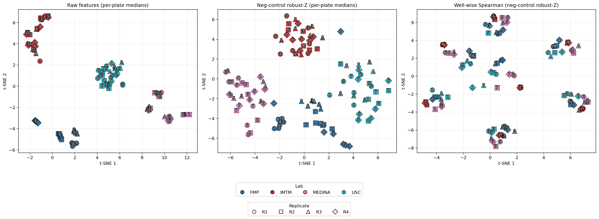

From the raw embedding (first subplot), plates cluster strongly by lab, reflecting a pronounced lab effect. Within some of these lab clusters—particularly in FMP—we also observe distinct replicate-level subclusters, suggesting additional replicate-specific variation. After applying control-based standardization (second subplot), replicate effects disappear, confirming that the normalization reduces within-lab variability. However, lab-level clustering remains visible, meaning that systematic lab differences persist even after normalization. In the well-wise correlation embedding (third subplot), plates that share the same compound set (same plate design) group together across labs and replicates, showing that the biological signal is preserved. Still, residual subclusters by lab are noticeable, indicating that normalization does not fully remove cross-lab biases. This highlights the importance of explicitly modeling and controlling for lab and replicate effects in downstream analyses to avoid confounding biological interpretation.

### Variance decomposition of controls across labs, replicates, and plates

To assess sources of variability in our assay, we performed a **nested variance decomposition** on three control compounds: **DMSO** (negative control), **Nocodazole**, and **Tetrandrine** (positive controls). We decompose the per–well cell counts $y$ into nested sources of variation. In particular, we decompose the variance as:
$$
\begin{aligned}
\sigma^2_{\text{Lab}} &= \mathrm{Var}(y) - \mathrm{Var}(r_1),\\[6pt]
\sigma^2_{\text{Rep}\mid\text{Lab}} &= \mathrm{Var}(r_1) - \mathrm{Var}(r_2),\\[6pt]
\sigma^2_{\text{Plate}\mid\text{Lab}\times\text{Rep}} &= \mathrm{Var}(r_2) - \mathrm{Var}(r_3),\\[6pt]
\sigma^2_{\text{res}} &= \mathrm{Var}(r_3).
\end{aligned}
$$

Where let $r_i$ denote the residuals after subtracting the corresponding conditional mean. For interpretability, we discard the residual component, which captures well-specific noise not explained by systematic factors, and renormalize the systematic parts so that their proportions sum to one. We perform this decomposition for each control compound separately.

\begin{figure}
\centering
\includegraphics[width=0.3\linewidth]{figures/variance_no_residual_controls_combined.png}
\caption{Toxic Compounds}
\end{figure}

-   **DMSO (negative control)**\
    The majority of variance is attributable to **lab-level effects** (\~60%), with smaller contributions from replicate (\~12%) and plate (\~29%). This indicates that even the baseline control is sensitive to systematic differences between labs.

-   **Nocodazole (positive control for mitotic arrest)**\
    Shows a very similar pattern: lab effects dominate (\~58%), with replicate and plate effects accounting for \~14% and \~28%, respectively. This suggests that the Nocodazole behaviour is also influenced primarily by inter-lab variability.

-   **Tetrandrine (positive control for cell death)**\
    Displays a different profile: lab variance is lower (\~36%), while **plate effects** contribute nearly half of the systematic variance (\~49%). This implies that the Tetrandrine response is less consistent across plates, making it more sensitive to plate-specific variation.

This decomposition reveals that: (1) **Lab effects dominate** for DMSO and Nocodazole, highlighting cross-lab biases; (2) **Plate-specific variability** is especially important for Tetrandrine, pointing to a potential compound-specific sensitivity to assay conditions.

In practice, these results emphasize the need for **control-based normalization** (e.g., robust Z anchored to DMSO).

### Compound-level distributions after negative-control standardization

To visualize a first assessment of effectiveness, we first **standardize cell counts within each plate using only negative controls (DMSO/EOS)**.  
The x-axis is flipped (high→low), so moving **right** corresponds to **lower cell counts than the negative control** (i.e. stronger inhibitory effect).

- **Bottom panel:** each compound is shown as a horizontal box-line.  
  * Thin line = p05–p95  
  * Thick line = IQR (p25–p75)  
  * Black dot = median of \(z\)  
  Compounds are ordered by their **median** standardized count.  

- **Top panel:** kernel density of per-compound medians, with vertical dotted lines marking the medians of **DMSO** ( $\approx$ 0 by construction), **Tetrandrine**, and **Nocodazole**.


Most compounds cluster around zero wit a large peak near DMSO, indicating little or no shift from the negative control after plate normalization.  
The distribution has a long rightward tail, meaning many compounds substantially reduce cell counts compared to DMSO.  

Control landmarks fall where expected: Tetrandrine lies left of Nocodazole, consistent with a weaker effect; Nocodazole is further right, reflecting a stronger effect.

Within-compound spread (IQR and p05–p95) highlights residual heterogeneity. Narrow bars near zero indicate stable, control-like behavior, while wide bars in the tail suggest stronger or context-dependent effects. This is worth noticing for follow-ups, as it means that we should take into account the entire distribution for assessing the effectiveness of promising compounds. In general, we can see different compounds display very different distributions across experiments.

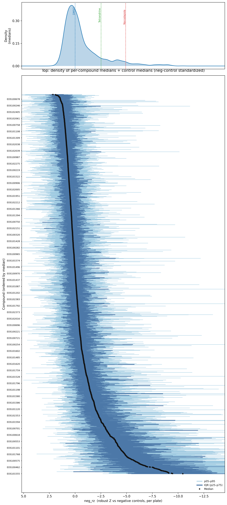
We further highlight this differences in the next plot, where we show the distributions of selected compounds, spanning a range of median effects and variability.
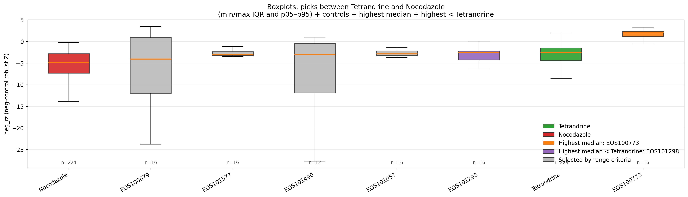


## Section 4: Clustering Analysis

In this section, we perform clustering of compounds to better understand their behavior relative to the controls (DMSO as negative control, and Nocodazole and Tetrandrine as positive controls).

### Addressing replicate and lab bias
In earlier analyses we observed significant sources of variation due to **lab, replicate, and plate effects**. Even after standardizing each feature by subtracting the median and dividing by the MAD of DMSO features within each plate, residual bias persisted across sites. To evaluate which site provided the most consistent replicates, we studied the **average cosine similarity** of feature vectors across replicate pairs. For each well, we compared the standardized feature vectors across replicates using cosine of the angle between them. Then we averaged the cosine similarities by aggregating across wells.

Formally, the average cosine similarity between replicates $i$ and $j$ from labs $A$ and $B$ is defined as

$$
S_{(A,i),(B,j)} = \frac{1}{|W|} \sum_{w \in W} 
\frac{\langle x^{(A)}_{w,i},\, x^{(B)}_{w,j} \rangle}{\|x^{(A)}_{w,i}\| \, \|x^{(B)}_{w,j}\|}.
$$
where $x_{w,i}^{(A)}$ represents the standardised feature vector of well $w$ in replicate $i$ of lab A. Here, $i,j \in \{1,\ldots,4\}, A,B \in \{FMP,IMTM,MEDINA,USC\}$ and $W:=$ set of unique well id's. If the treatment effect were dominant in all replications, we would expect these similarities to be close to one and hence $S_{(A,i),(B,j)}$ would be close to one for all $A,b,i,j$.

The heatmap in Figure 12 shows that cross-lab similarities were low overall. Within-site comparisons, however, revealed that the **FMP site** displayed the highest replicate consistency (darker red shades). Consequently, we restricted subsequent clustering analyses to FMP data.

### Dimensionality reduction and clustering
For clustering, we projected the standardized FMP feature vectors onto the principal component space. The first 14 principal components (PCs), explaining 80% of the total variance, were retained. For each well, the PC scores were then averaged across replicates, producing a single representative 14-dimensional vector per well. Because each replicate within lab FMP showed highest similarity, they can be assumed to demonstrate effect of treatment in each well independently without any confounding factors. As a result, averaging features of each well across replicates just strengthens the biological signal in the data and avoids identical wells across replicates from clustering together.

On these averaged PC scores, we applied Ward’s hierarchical clustering with five clusters. We chose Ward’s method for clustering as it is an agglomerative hierarchical clustering algorithm that iteratively merges clusters to minimize the increase in within-cluster variance, thereby producing compact and well-separated clusters.

```{r clustering1, fig.cap="Average cosine similarity between replicate pairs across labs. FMP displays the highest consistency.", echo=FALSE, out.width="40%", fig.align='center', fig.pos='H'}
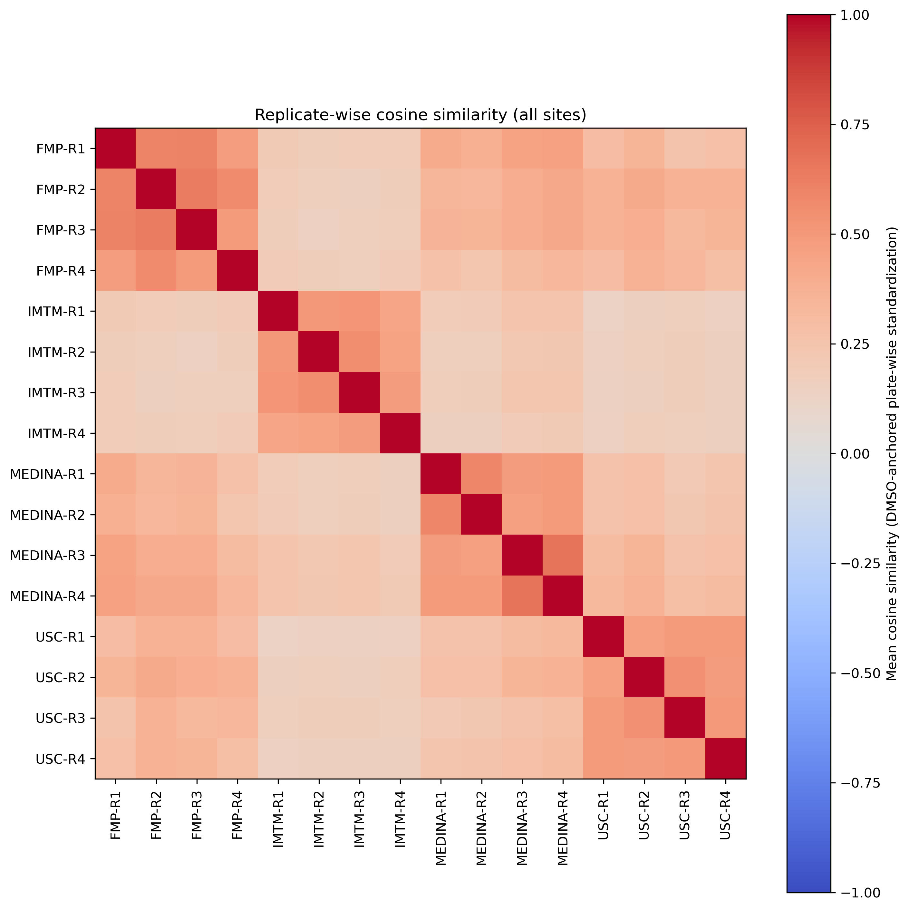
```
```{r,fig.cap="Capture Rate Table of each cluster",echo=FALSE,  out.width="50%", fig.align='center', fig.pos='H'}
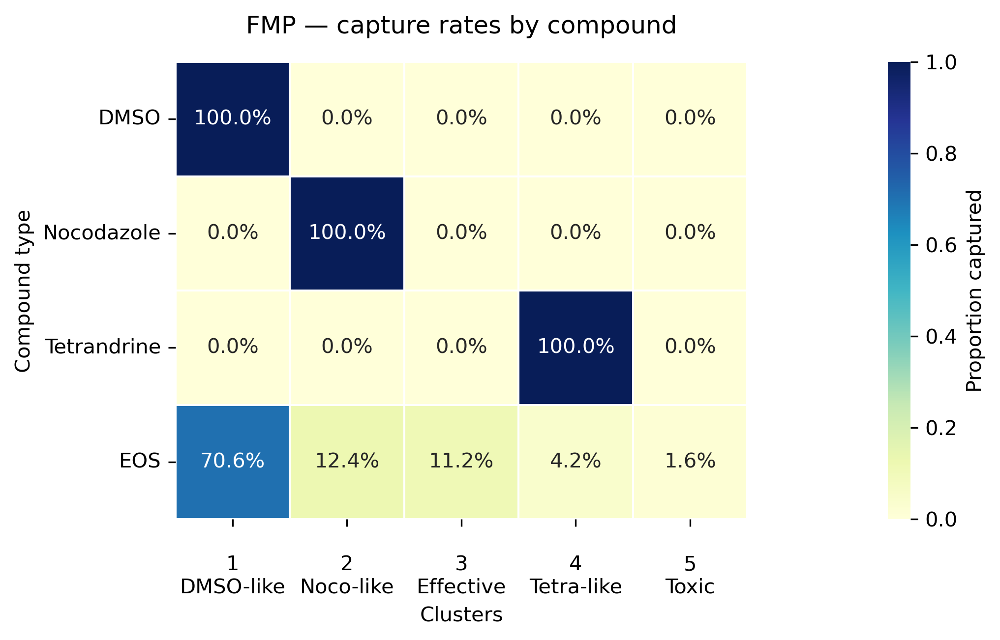
```

### Interpretation of clusters
The capture rate plot (Figure 13) shows that the three controls (DMSO, Nocodazole, Tetrandrine) each fall into separate clusters, validating the effectiveness of the method in identifying the feature vector corresponding to control compounds perfectly. The plot then tells us that

- approximately 70.6% compounds that were tested were neutral like DMSO,
- about 12.4% function like Nocodazole and inhibit cell division,
- about 4.2% function like Tetrandrine and implement similar anti-cancer methods,

Examining the distribution of standardized cell counts across clusters (Figure 14), we also observe:

- Cluster 5 has a dangerously low median of within-cluster standardised cell counts. This  indicates that the treatment compounds in the wells of this cluster are likely toxic and kill cells indiscriminately. There are 1.6% of these compounds.
- Cluster 3 has compounds which result in a negative median of standardised cell counts. This indicates effectiveness, but since their feature vectors were not similar to Nocodazole and Tetrandrine their mechanisms of action (MOA) are subject for further experimentation. There are 11.2% of such compounds.

```{r,fig.cap="Within cluster median standardized cell count",echo=FALSE, out.width="70%", fig.align='center', fig.pos='H'}

```

Finally, we visualized the distribution of clusters across plates (Figure 15). This provides a spatial view of how compounds grouped in the clustering analysis.

```{r,fig.cap="Plates colored according to cluster assignment",echo=FALSE,out.width="100%", fig.align='center', fig.pos='H'}
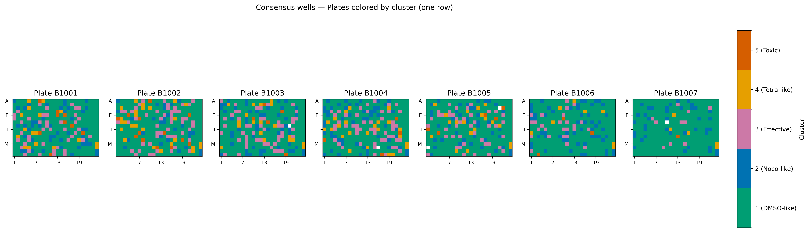

```

The following tables also show the list of compounds which we classify as Toxic or Effective compounds with Unknown MOA. We include a list of Nocodazole like and Tetrandrine like compounds in our github (https://github.com/filippomichelis/604-proj-1.git) as well.

\begin{figure}
\centering
\includegraphics[width=0.5\linewidth]{figures/toxic.png}
\caption{Toxic Compounds}
\end{figure}

\begin{figure}
\centering
\includegraphics[width=1.1\linewidth]{figures/eff_unknown_moa.png}
\caption{Effective Compounds with Unknown MOA}
\end{figure}

## Conclusions and Suggestions

This study examined a multi-site, multi-replicate imaging screen and used control-based normalization and clustering to assess compound behavior relative to DMSO (negative control) and Nocodazole and Tetrandrine (the positive controls).

Normalization based on DMSO (median/MAD per plate) substantially reduced replicate-level drift and preserved biological structure, as seen in the normalized heatmaps ( Figure 7) and the site-averaged views (Figure 9). Nevertheless, the correlation heatmap (Figure 8) and cosine similarity plot (Figure 12) reveal strong, tight blocks within each site alongside weaker cross-site correlations, indicating that each laboratory retains a distinctive effect even after correction. These residual site effects imply that modeling and inference steps should explicitly control for the lab and replicate factors rather than assuming a single homogeneous dataset.

The variance maps further show that reliability is plate-dependent and site-dependent. Certain plates exhibit low within-site variance (e.g., plates 1 and 2 at FMP), whereas others show high variability at particular sites (e.g., plates 6 and 7 at USC and IMTM). These patterns demonstrate the need for plate-specific quality control and, where needed, selective down-weighting or exclusion of problematic plates in summary analyses.

At the compound level, the distribution of effectiveness is heterogeneous. The summarized medians and distributional plots show a large mass near DMSO-like behavior with a substantial tail of compounds that reduce cell counts relative to DMSO. Because of this skew and spread, selection decisions should consider the entire distribution — median, interquartile range, and tails — rather than relying on a single summary statistic.

For clustering, we restricted attention to the FMP site, due to it's replicates having the least amount of bias. We projected standardized features onto the first 14 principal components (capturing at least 80% of the variance), averaged PC scores across replicates per well, and applied Ward’s hierarchical clustering with five clusters. The capture-rate view (Figure 13) confirms that the three controls (DMSO, Nocodazole, Tetrandrine) separate cleanly into distinct clusters, validating the method. Cluster-wise medians of standardized cell counts (Figure 14) reveal two particularly actionable groups: a toxic cluster with the lowest medians (Cluster 5) and a cluster of effective compounds whose behavior is not Nocodazole- or Tetrandrine-like (Cluster 3). The plate maps colored by cluster assignments (Figure 15) provide a spatial overview of how these groups distribute across wells.

Methodologically and experimentally, these observations motivate a few concrete steps. In future experiments, randomizing well positions within each replicate will help break residual spatial confounding and reduce position-dependent bias. In analysis, models should include site and replicate effects (e.g., via fixed or mixed effects), continue to use control-based normalization, and incorporate plate-specific quality control to identify outliers or unstable plates before aggregation. Compound summarization should rely on distributional views rather than a single measure. For follow-up experimentation, Cluster-3 candidates (Figure 17) need to be investigated to understand how their mechanisms are distinct from the two positive controls, while compounds in the toxic cluster (Figure 16) should be handled accordingly. Finally, rerunning a targeted subset of plates at lower-reliability sites with improved quality control and randomization can test whether normalization narrows the cross-lab gaps that remain visible in the normalized summaries and correlation structures.


